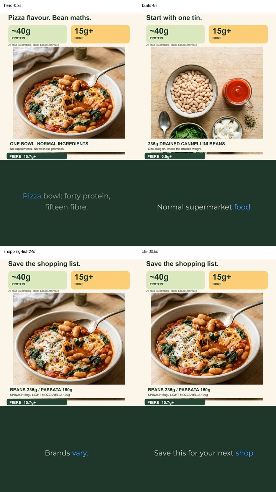
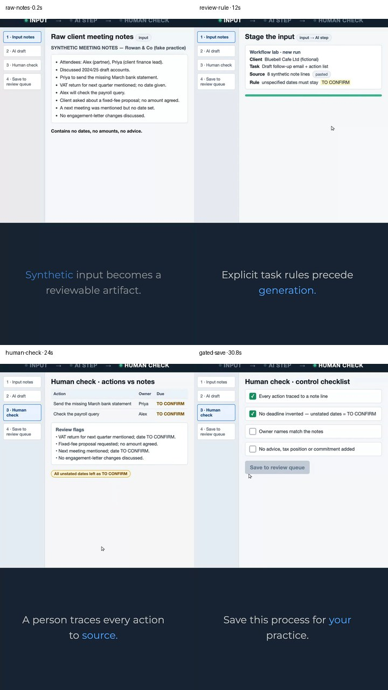

# Reviewed creation examples

These are stills from the two pilot renders completed by:

```sh
social-influence create --brand gutkitchen --next
social-influence create --brand ai-for-accountants --next
```

They demonstrate that one queue-to-reviewed-MP4 interface can preserve radically
different brand grammars. They are **pilot examples, not proof of social-account
publishing**.

## GutKitchen — pizza-bean bowl



**Title:** Pizza-bean bowl: 40g protein, 15g+ fibre — one portion, four supermarket ingredients (label estimate)

**Caption:** Pizza-bean bowl. One portion: an estimated 40g protein and at least 15g fibre from 235g drained cannellini beans, 150g passata, 50g baby spinach and 100g lighter mozzarella. Label-based estimate — check the pack you buy. Recipe not physically tested. Visuals are AI food illustrations, not filmed food.

**Hashtags:** `#GutKitchen` `#highprotein` `#fibre` `#beans` `#pizza` `#budgetmeals` `#quickmeals` `#recipes` `#labelbased` `#UKfood`

| Hero / first-frame packaging | Ingredient build | Shopping-list close | CTA |
|---|---|---|---|
| [hero](assets/gutkitchen-hero.jpg) | [build](assets/gutkitchen-build.jpg) | [shopping list](assets/gutkitchen-shopping-list.jpg) | [CTA](assets/gutkitchen-cta.jpg) |

**Visual grammar:** finished meal first, `~40g PROTEIN` and `15g+ FIBRE` badges,
top-down ingredient layout, progressive fibre counter, ordinary supermarket
ingredients, and visible `AI food illustration | label-based estimate`
disclosure.

**Review status:** reviewed pilot render. The final handoff sets
`ready_for_publication: false` because the meal visuals are generated
illustrations rather than footage of a physically tested recipe. Public use
still requires explicit approval and platform AI-content labeling.

**Evidence:** [production pack](../../brands/gutkitchen/posts/40g-protein-15g-fibre-pizza-bean-bowl-using-supermarket-ingr-967b36228b.json) ·
[run artefacts](../evidence/2026-09-29/runs/gutkitchen-attempt-0023/) ·
[acceptance summary](../evidence/2026-09-29/creation-pilot-acceptance.md)

## AIForAccountants — meeting notes to reviewable follow-up



**Title:** AI-drafted follow-up for your client — human-checked

**Caption:** Client meeting notes to follow-up draft — but no deadline gets invented and nothing saves until a human checks every action. This is our workflow-lab demo with synthetic data, not a vendor UI. Comment the accounting task you still do manually — or save this for your practice.

**Hashtags:** `#AIToollace` `#AccountingAutomation` `#AIWorkflow` `#PracticeOps` `#HumanInTheLoop`

| Raw notes | Review rule | Human check | Gated save |
|---|---|---|---|
| [raw notes](assets/ai-for-accountants-raw-notes.jpg) | [review rule](assets/ai-for-accountants-review-rule.jpg) | [human check](assets/ai-for-accountants-human-check.jpg) | [gated save](assets/ai-for-accountants-gated-save.jpg) |

**Visual grammar:** a real Playwright recording of an own functional
`Workflow lab`, persistent `INPUT -> AI STEP -> HUMAN CHECK`, `SYNTHETIC DATA`,
`REVIEW REQUIRED`, explicit `TO CONFIRM` dates, action tracing and a checklist
that gates save. No real client data or vendor UI imitation appears.

**Review status:** reviewed pilot render. It demonstrates the shared architecture,
but no social account was connected or published.

**Evidence:** [production pack](../../brands/ai-for-accountants/posts/turn-raw-client-meeting-notes-into-a-follow-up-email-action--55f1a74aa4.json) ·
[run artefacts](../evidence/2026-09-29/runs/ai-for-accountants-attempt-0002/) ·
[acceptance summary](../evidence/2026-09-29/creation-pilot-acceptance.md)

## What these examples prove

- Ordered brand queues can drive the same creation and review interface.
- Content Machine generation, deterministic approved-copy rebuild, provenance,
  caption sync, cadence and final review can produce a complete MP4 bundle.
- Different visual lanes are selected from the brand profile and approved media,
  not from brand-name branches in the CLI.

## What they do not prove

- Public publishing through the self-hosted publisher or any social platform.
- Human editorial sign-off; the recorded reviews are Codex agent reviews.
- That the GutKitchen AI illustrations are acceptable for public food content.
- Postiz connectivity. The current repository uses the self-hosted publisher;
  Postiz is not used.
